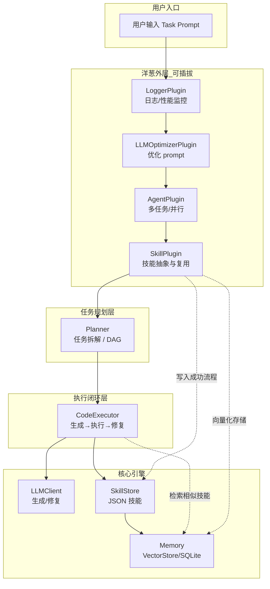

# 下一阶段开发路线图：模块关系与插件接口

## 一、模块关系总览



**数据流（请求方向）**：用户 → Logger → LLMOptimizer → Agent → Skill(pre) → Planner → CodeExecutor → LLM/SkillStore/Memory。

**数据流（响应方向）**：CodeExecutor 结果 → Skill(post，抽象并写入) → 各插件 post_execute → 用户。

---

## 二、插件接口与调用顺序

### 2.1 统一插件接口（已有）

```python
class Plugin:
    def pre_execute(self, task_prompt: str) -> str:
        """代码生成前：可改写/增强 prompt。"""
        return task_prompt

    def post_execute(self, result: dict) -> dict:
        """执行完成后：可记录、抽象技能、聚合结果。"""
        return result

    def on_error(self, error_info: str) -> str:
        """执行出错时：可记录、返回修正建议。"""
        return error_info
```

### 2.2 执行时调用顺序（main / 调度层）

```text
1. prompt = plugin_manager.apply_pre_execute(task_prompt)   # 从外到内：Logger → LLMOptimizer → Agent → Skill
2. [可选] sub_tasks = planner.decompose(prompt)             # 拆解为 DAG/列表
3. result = code_executor.execute_task(prompt)             # 或对每个 sub_task 执行
4. result = plugin_manager.apply_post_execute(result)      # 从内到外：Skill → Agent → LLMOptimizer → Logger
5. 若 3 抛错：plugin_manager.apply_on_error(str(e))
```

### 2.3 各插件职责与连接方式

| 插件 | pre_execute | post_execute | on_error | 依赖/输出 |
|------|-------------|--------------|----------|-----------|
| **LoggerPlugin** | 记录 task | 记录 success/stdout/stderr、耗时 | 记录 error | 无外部存储，仅 logging |
| **SkillPlugin** | 从 Memory/SkillStore 检索相似任务，拼到 prompt 前 | 成功时把 code+task 写入 SkillStore，可选写入 VectorStore | 透传 | SkillStore, VectorStore |
| **AgentPlugin** | 可选：拆解为多子任务，暂不执行 | 可选：聚合多子任务结果 | 透传 | 与 Planner 配合 |
| **LLMOptimizerPlugin** | 可选：调用 LLM 改写/补全 prompt | 透传 | 可选：根据 error 生成修复建议 | LLMClient（只读/只写 prompt） |

---

## 三、技能抽象与复用（SkillPlugin + Memory）

### 3.1 数据流

```text
post_execute(success=True) 时：
  result["task"] + result["code"] → SkillStore.add()
  result["task"] + result["code"] → VectorStore.add()  # 可选，用于语义检索

pre_execute 时：
  VectorStore.search(task_prompt, top_k=5) 或 SkillStore.search_by_task(task_prompt)
  → 将检索到的“相似成功流程”拼到 task_prompt 前，供 LLM 参考
```

### 3.2 接口约定

- **SkillStore**（已有）：`add(task, code, success)`、`get_recent(n)`、`search_by_task(query)`。
- **VectorStore**（待增强）：`add(text, metadata)`、`search(query, top_k)` 返回 `[{text, metadata}, ...]`，供 SkillPlugin 在 pre 阶段做语义检索。

### 3.3 与 CodeExecutor 的关系

- CodeExecutor 只负责“执行 + 写 SkillStore”（当前已在 `execute_task` 内写 SkillStore）。
- SkillPlugin 的 post_execute 可**额外**写 VectorStore、或做更细的“技能抽象”（如提取步骤、标签），与现有 SkillStore 并存，不破坏闭环。

---

## 四、任务规划与多任务调度（Planner + AgentPlugin）

### 4.1 层级关系

```text
Planner：纯函数/无状态
  输入：task_prompt (str)
  输出：sub_tasks (List[str]) 或 DAG (List[{id, deps, prompt}])

AgentPlugin（或单独 Runner）：
  输入：sub_tasks 或 DAG
  行为：按依赖/并行度调用 CodeExecutor.execute_task(sub_task)，再聚合结果
  输出：合并后的 result（如 list of result、或按 DAG 汇总）
```

### 4.2 接口思路

- **Planner**：
  - `decompose(prompt: str) -> List[str]`（当前已有，单任务透传）；
  - 下一阶段：`plan_to_dag(prompt: str) -> List[{id, deps, prompt}]`，供 AgentPlugin 或调度器使用。
- **AgentPlugin**：
  - pre_execute：可选调用 `Planner.decompose` 或 `plan_to_dag`，将“单 prompt”变为多子任务，存到上下文；
  - 实际执行可在“调度层”做：先 `apply_pre_execute` 得到可能被改写的 prompt 或子任务列表，再对每个子任务执行闭环，最后用 `apply_post_execute` 聚合。

### 4.3 与闭环的关系

- 核心闭环仍是：**单次 `CodeExecutor.execute_task(prompt)`**。
- Planner + Agent 只负责“拆任务”和“多次调用 execute_task + 聚合”，不改变单次执行的语义。

---

## 五、监控/日志/反馈（LoggerPlugin）

- **LoggerPlugin**：在 pre/post/on_error 打日志；post 可计算耗时、统计 success。
- 可选扩展：将统计结果写入 SQLite（已有 `SQLiteStore`）或单独报表模块，供“分析成功率、错误类型、性能报告”使用。与现有 Plugin 接口兼容，不破坏内核。

---

## 六、开发优先级（与你的路线一致）

1. **PluginManager 核心 + LoggerPlugin + SkillPlugin**（已有骨架，重点增强 SkillPlugin 与 Memory）
2. **技能抽象 + 存储 + 检索**：SkillStore 已有；补 VectorStore 实现（如 Chroma）；SkillPlugin 中 pre 检索、post 写入
3. **Planner + DAG + 并行**：Planner 扩展为 DAG；AgentPlugin 或单独 Runner 按 DAG 调用 execute_task 并聚合
4. **LLMOptimizerPlugin**：pre 优化 prompt；on_error 可选提供修复建议

---

## 七、迭代示例流程（按图实现时的顺序）

```text
1. 用户输入目标 → task_prompt
2. plugin_manager.apply_pre_execute(task_prompt)
   → Logger 记日志
   → LLMOptimizer 可选改写 prompt
   → Agent 可选拆解为子任务（或交给 Planner）
   → Skill 从 Memory/SkillStore 检索，拼到 prompt
3. 若为单任务：result = code_executor.execute_task(prompt)
   若为多任务：对每个子任务执行 execute_task，再聚合
4. plugin_manager.apply_post_execute(result)
   → Skill 将成功流程写入 SkillStore + 可选 VectorStore
   → Agent 可选聚合多任务结果
   → Logger 记录结果与耗时
5. Planner 可独立于插件：仅负责 decompose / plan_to_dag，由调用方（main 或 AgentPlugin）使用
```

---

**原则**：每一层都不破坏 Cursor 的闭环核心；插件只做“外层增强”，核心仍是「生成 → 执行 → 修复」单次闭环。
